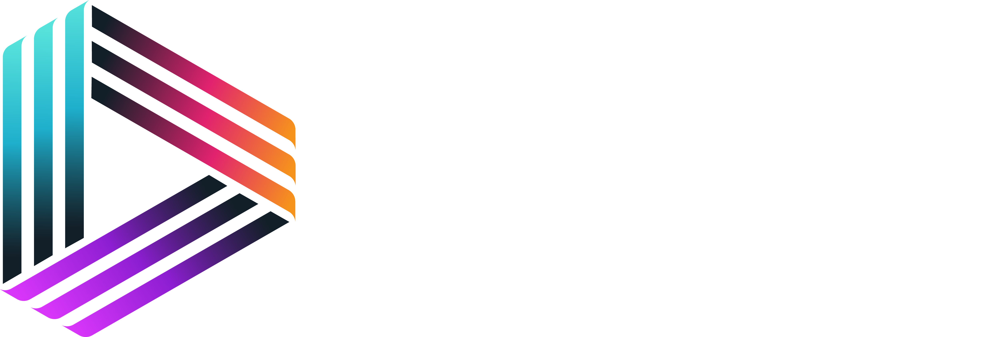

<br/>
<p align="center">

</p>
<br/>

# Ray Finance Smart Contracts

# About

This project is meant to be a system for tracking the shareholders of the protocol, enabling staking in lockless+feeless vaults and automating the distribution of the revenue of the protocol in the form of stablecoin rewards or reinvestments into other tokens.

- [Ray Finance Smart Contracts](#foundry-defi-stablecoin)
- [About](#about)
- [Getting Started](#getting-started)
  - [Requirements](#requirements)
  - [Quickstart](#quickstart)
    - [Optional Gitpod](#optional-gitpod)
- [Usage](#usage)
  - [Start a local node](#start-a-local-node)
  - [Deploy](#deploy)
  - [Deploy - Other Network](#deploy---other-network)
  - [Testing](#testing)
    - [Test Coverage](#test-coverage)
- [Deployment to a testnet or mainnet](#deployment-to-a-testnet-or-mainnet)
  - [Scripts](#scripts)
  - [Estimate gas](#estimate-gas)
- [Formatting](#formatting)
- [Slither](#slither)

# Getting Started

## Requirements

- [git](https://git-scm.com/book/en/v2/Getting-Started-Installing-Git)
  - You'll know you did it right if you can run `git --version` and you see a response like `git version x.x.x`
- [foundry](https://getfoundry.sh/)
  - You'll know you did it right if you can run `forge --version` and you see a response like `forge 0.2.0 (23700c9 2024-05-22T00:16:24.626070934Z)`

## Quickstart

```
git clone https://github.com/RayFinance/rayfi-contracts
cd rayfi-contracts
make install
forge build
```

### Optional Gitpod

If you can't or don't want to run and install locally, you can work with this repo in Gitpod. If you do this, you can skip the `clone this repo` part.

[](https://gitpod.io/#github.com/RayFinance/rayfi-contracts)

# Usage

## Start a local node

```
make anvil
```

## Deploy

This will default to your local node. You need to have it running in another terminal in order for it to deploy.

```
make deploy
```

## Deploy - Other Network

[See below](#deployment-to-a-testnet-or-mainnet)

## Testing

```
forge test
```
**Note**: Running tests which rely on `UniswapV2` mocks requires first modifying the hash used by `UniswapV2Library.sol` with the `keccak256` of the compiled bytecode of `UniswapV2Pair.sol`, which is usually different depending on the machine that compiled it.

**Step 1**

Ensure `UniswapV2` artifacts are built, which can be done by saving `script/CreateUniswapV2FactoryArtifact.s.sol` and `script/CreateUniswapV2RouterArtifact.s.sol`, then running `forge build`.

**Step 2**

Copy to clipboard the `"bytecode"` object in `out/UniswapV2Pair.sol/UniswapV2Pair.json`.

**Step 3**

In the terminal, type `cast keccak` and paste the bytecode, then run the command.

**Step 4**

Use the terminal output to replace the `hex` string (with comment "init code hash") in `pairFor` of `lib/v2-periphery/contracts/libraries/UniswapV2Library.sol`. Remember to remove the `0x` prefix.

**Step 5**

`forge build` again and you are ready to run tests.

### Test Coverage

```
forge coverage
```

and for coverage based testing:

```
forge coverage --report debug
```

# Deployment to a testnet or mainnet

1. Setup environment variables

You'll want to set your `OPBNB_TESTNET_RPC_URL`, `OPBNB_TESTNET_ACCOUNT` and  `TESTNET_PASSWORD` as environment variables by adding them to a `.env` file.

- `OPBNB_TESTNET_RPC_URL`: This is the url of the opBNB Testnet node you're working with. You can get setup with one for free from [NodeReal](https://nodereal.io/invite/8ce49206-2b64-401d-9e75-648189f5cf64).
- `OPBNB_TESTNET_ACCOUNT`: The name of the Foundry keystore to use. [Learn how to create one here](https://book.getfoundry.sh/reference/cast/cast-wallet-import).
- `TESTNET_PASSWORD`: The password to the keystore. 

**NOTE:** FOR DEVELOPMENT, PLEASE USE A WALLET THAT DOESN'T HAVE ANY REAL FUNDS ASSOCIATED WITH IT.

Before keystores were fully implemented, you had to directly set your `PRIVATE_KEY` environment variable. This is **strongly discouraged** for security reasons and everyone should switch to a safer method. Other alternatives [can be found here](https://book.getfoundry.sh/tutorials/best-practices#private-key-management).

1. Get testnet BNB

Head over to the [BNB Faucet](https://www.bnbchain.org/en/testnet-faucet) and get some testnet BNB. You should see the BNB show up in your metamask.

2. Bridge over to opBNB Testnet

Head over to the [opBNB Bridge](https://opbnb-testnet-bridge.bnbchain.org/deposit) and deposit your testnet BNB on opBNB Testnet.

3. Deploy

```
make deploy ARGS="--network opbnb-testnet"
```

## Scripts

Several scripts can be activated with `Makefile` shortcuts, for example:

1. Create the RAYFI Liquidity Pool

```
make create-pair
```

2. Fund the RAYFI contract with USDT rewards

```
make fund
```

3. Distribute all the rewards in a single run

```
make distribute-stateless
```

Any command can be appended with `ARGS="--network opbnb-testnet"` to work on opBNB Testnet.

Instead of scripts, we can also directly use the `cast` command to interact with the contract.

For example, on opBNB Testnet:

1. Transfer some tokens

```
cast send --rpc-url $OPBNB_TESTNET_RPC_URL --gas-limit 100000 --gas-price 100000 --account $OPBNB_TESTNET_ACCOUNT --password $TESTNET_PASSWORD 0xf39Fd6e51aad88F6F4ce6aB8827279cffFb92266 "transfer(address,uint256)" 0x70997970C51812dc3A010C7d01b50e0d17dc79C8 10000000000000000000000 
```

2. Stake the tokens

```
cast send --rpc-url $OPBNB_TESTNET_RPC_URL --gas-limit 100000 --gas-price 100000 --account $OPBNB_TESTNET_ACCOUNT --password $TESTNET_PASSWORD 0xf39Fd6e51aad88F6F4ce6aB8827279cffFb92266 "stake(address,uint256)"  0x3C44CdDdB6a900fa2b585dd299e03d12FA4293BC 10000000000000000000000
```

3. Unstake some tokens

```
cast send --rpc-url $OPBNB_TESTNET_RPC_URL --gas-limit 100000 --gas-price 100000 --account $OPBNB_TESTNET_ACCOUNT --password $TESTNET_PASSWORD 0xf39Fd6e51aad88F6F4ce6aB8827279cffFb92266 "unstake(address,uint256)"  0x3C44CdDdB6a900fa2b585dd299e03d12FA4293BC 5000000000000000000000
```

The same can be done on `anvil` replacing all the above options (`--*`) with just `--unlocked --from`, where `--from` could be any of the available accounts.

## Estimate gas

You can estimate how much gas things cost by running:

```
forge snapshot
```

And you'll see an output file called `.gas-snapshot`

# Formatting

To run code formatting:

```
forge fmt
```

# Slither

For an install guide, refer to the [Slither docs](https://github.com/crytic/slither?tab=readme-ov-file#how-to-install).

To run `slither` using the config file included in the project:

```
slither .
```
